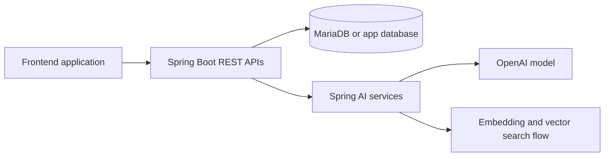

# 21 Project - Spring E-Commerce Learning Bundle

This folder groups the Spring Boot and frontend parts of an AI-enabled e-commerce application. It is useful for learners who want to see how classic product APIs evolve into AI-assisted features such as smarter product search, richer descriptions, and chatbot-style experiences.

## What this folder teaches

- How a traditional backend and frontend pair with AI features
- How Spring Boot APIs can be extended with model-driven capabilities
- How a non-AI baseline project compares with an AI-enhanced version

## Project contents

- `SpringEcom` - base e-commerce backend without the full AI layer
- `SpringEcomAI` - AI-enhanced backend with Spring AI and vector search ideas
- `e-com-Frontend` - frontend application for interacting with the backend services

## Architecture overview



## Prerequisites

- Java 21
- Node.js and npm for the frontend
- MariaDB for the AI backend project
- OpenAI API key for `SpringEcomAI`

## How to use this folder

Recommended order:
1. Open `SpringEcom` to understand the normal backend flow
2. Open `SpringEcomAI` to see what AI-specific additions change
3. Run `e-com-Frontend` against the backend you want to explore

## Run commands

Backend examples:

```powershell
cd C:\projects\TeluskoProjects\AI-Engineering-Live\21_Project\SpringEcom
.\mvnw.cmd spring-boot:run
```

```powershell
cd C:\projects\TeluskoProjects\AI-Engineering-Live\21_Project\SpringEcomAI
.\mvnw.cmd spring-boot:run
```

Frontend:

```powershell
cd C:\projects\TeluskoProjects\AI-Engineering-Live\21_Project\e-com-Frontend
npm install
npm run dev
```

## Expected result

You should be able to compare a standard e-commerce backend with an AI-aware version and see how the frontend interacts with both product data and AI-powered features.

## What to study here

- Backend controller and service differences between `SpringEcom` and `SpringEcomAI`
- The `application.properties` file in `SpringEcomAI` to understand model and vector-store setup
- Frontend components that talk to product or chatbot endpoints

## Troubleshooting

- Make sure the frontend points to the correct backend port
- If the AI backend fails, check MariaDB connectivity and the `OPENAI_API_KEY` placeholder value
- If product uploads or images fail, verify multipart limits and static asset handling

## Production considerations

- Frontend and backend would need stronger validation, auth, and monitoring
- Vector search and image generation calls should be cost-aware
- Product AI responses should be audited for hallucinations or unsafe content

## What to study next

Move to `22_Project` to compare the same product idea in a Python and LangChain stack.
