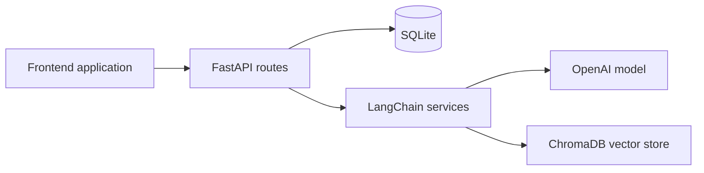

# 22 Project - Python and LangChain E-Commerce Variant

This folder is a study bridge between the Java or Spring AI approach and a Python or LangChain implementation of a similar AI-enabled product experience. It is especially helpful for professionals comparing stack choices across the same problem space.

## What this folder teaches

- How the same e-commerce AI idea can be implemented in Python
- How LangChain-based services compare with Spring AI services
- How a frontend can stay stable while backend AI implementation changes

## Project contents

- `SpringEcomAI-LangChain` - Python, FastAPI, LangChain, ChromaDB, and SQLite version of the AI backend
- `e-com-Frontend` - frontend application for interacting with the backend

## Architecture overview



## Prerequisites

- Python 3.11+ or the version supported by the project
- Node.js and npm for the frontend
- OpenAI API key

## How to use this folder

1. Read `SpringEcomAI-LangChain/README.md` for the backend details
2. Create the `.env` file from the included `.env.example` in that subproject
3. Run the FastAPI backend
4. Run the frontend and compare the experience with `21_Project`

## Run commands

Backend:

```powershell
cd C:\projects\TeluskoProjects\AI-Engineering-Live\22_Project\SpringEcomAI-LangChain
uv venv
.venv\Scripts\activate
uv pip install -r requirements.txt
uvicorn main:app --reload
```

Frontend:

```powershell
cd C:\projects\TeluskoProjects\AI-Engineering-Live\22_Project\e-com-Frontend
npm install
npm run dev
```

## Expected result

You should be able to explore a Python-native AI backend that offers product APIs, semantic search, and chatbot behavior similar to the Spring version.

## What to study here

- FastAPI routers and service modules
- `.env.example` and `config/vector_store.py` to understand environment and vector-store setup
- Similarities and differences between `21_Project` and this folder in data flow and user experience

## Troubleshooting

- If startup fails, verify the Python version and virtual environment activation
- If vector features fail, check the ChromaDB setup and folder permissions
- If the frontend cannot reach the backend, verify the API base URL and port configuration

## Production considerations

- Replace local SQLite or Chroma defaults with production-grade storage where needed
- Persist chat memory beyond process lifetime if the chatbot becomes user-facing
- Add auth, request limits, logging, and observability around AI endpoints

## What to study next

Compare this with `My_Personal_Tutor` for a larger Java application or move to `LANGGRAPH-DEMO` for workflow-oriented orchestration.
