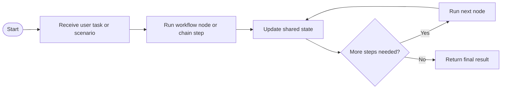

# LangGraph Demo

This folder is a practical sandbox for learning how LangGraph models multi-step AI workflows. Instead of a single chat prompt, these scripts show how to think in nodes, transitions, and state updates.

## What this folder teaches

- How LangGraph organizes work into explicit workflow steps
- How to compare simple chaining with more structured agent-like flows
- How diagrams and code map to each other in a workflow-oriented AI project

## Why this matters

LangGraph becomes useful when prompt chains stop being enough. This folder helps learners see when they need stateful orchestration, branching, or a clearer workflow model.

## Workflow overview



## Project contents

- `main.py` - simple Python entry point
- `prompt-chaining.py` - prompt chaining example
- `loan_eligibility.py` - workflow example for decision-style logic
- `health-report.py` - workflow example for structured reporting
- `.mmd` and `.png` files - visual artifacts showing workflow shapes

## Prerequisites

- Python version supported by `pyproject.toml`
- `uv` or pip-based environment setup
- OpenAI API key in a local `.env` file

## Setup

Create a local `.env` from `.env.example` and add your OpenAI key.

## How to run

From `C:\projects\TeluskoProjects\AI-Engineering-Live\LANGGRAPH-DEMO`:

```powershell
uv venv
.venv\Scripts\activate
uv sync
python main.py
```

To explore individual workflows, run the specific script you want to study, for example:

```powershell
python loan_eligibility.py
```

## Expected result

You should see how a workflow-oriented script organizes multiple reasoning steps more explicitly than a single prompt call. The generated outputs and included diagrams should make the node flow easier to follow.

## What to study here

- Compare `prompt-chaining.py` with the more structured workflow scripts
- Use the Mermaid or image artifacts as a high-level map before reading code
- Focus on how state is passed and how each step contributes to the final output

## Troubleshooting

- If imports fail, verify that `uv sync` or dependency installation completed successfully
- If model calls fail, verify the `.env` file and OpenAI key value
- If the Python version is incompatible, align it with the requirement declared in `pyproject.toml`

## Production considerations

- Add logging and tracing around node transitions
- Formalize state schemas before growing a workflow
- Handle retries and failure paths for each step explicitly

## What to study next

Move to `19_LangGraph_Sequential_Workflow_12-01-2026` and `20_LangGraph_Parallel_Workflow_13-01-2026` for more focused workflow patterns.
