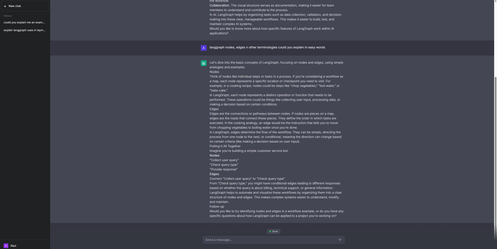

# AI Tutor Application

A powerful, intelligent learning companion built with **Java 21**, **Spring Boot 3**, and **Spring AI**. This application acts as a personal tutor, capable of answering questions, retrieving course content via **RAG** (Retrieval-Augmented Generation), and maintaining long-term conversation history.

![AI Tutor Interface] (Add a screenshot link here if you have one, e.g. from the artifacts)


## 🚀 Features

-   **Interactive Chat**: Real-time chat interface powered by WebSockets and OpenAI's GPT-4o.
-   **Multi-Session Support**: Create multiple distinct chat sessions, switch between them instantly, and preserve separate histories.
-   **RAG (Retrieval-Augmented Generation)**: Ingests and searches course documentation to provide accurate, context-aware answers.
-   **Persistent Memory**: Stores conversation history and user progress in MariaDB with JSON and Vector support.
-   **Agentic Capabilities**: The AI can "plan" and use tools (like searching the codebase or web) to answer complex queries.
-   **Modern UI**: Clean, responsive interface built with Tailwind CSS and Markdown rendering.

## 🛠️ Tech Stack

-   **Backend**: Java 21, Spring Boot 3.2+
-   **AI Framework**: Spring AI (Milestone 1)
-   **Database**: MariaDB (Native SQL Vector support)
-   **LLM**: OpenAI (GPT-4o)
-   **Frontend**: HTML5, Vanilla JavaScript, Tailwind CSS, SockJS/STOMP
-   **Build Tool**: Maven

## 📋 Prerequisites

1.  **Java 21 SDK** installed.
2.  **MariaDB** (10.6+ recommended) installed and running.
3.  **OpenAI API Key**.

## ⚙️ Setup & Installation

1.  **Clone the Repository**
    ```bash
    git clone https://github.com/your-repo/ai-tutor.git
    cd ai-tutor
    ```

2.  **Configure Database**
    -   Create a database named `tutor_db`.
    -   Ensure your MariaDB instance supports vectors (or use the provided `schema.sql` which attempts to set up the vector column).

3.  **Configure Environment Variables**
    Update `src/main/resources/application.yml` or set environment variables:
    ```yaml
    spring:
      datasource:
        url: jdbc:mariadb://localhost:3306/tutor_db
        username: <YOUR_DB_USER>
        password: <YOUR_DB_PASSWORD>
      ai:
        openai:
          api-key: <YOUR_OPENAI_API_KEY>
    ```

4.  **Database Initialization**
    The application is configured to run `schema.sql` automatically (`spring.sql.init.mode: always`). This handles table creation:
    -   `course_embeddings`: Stores RAG content and vectors.
    -   `chat_sessions`: Stores multi-session chat history.
    -   `user_memory`: (Legacy) Stores user progress.

5.  **Run the Application**
    ```bash
    mvn spring-boot:run
    ```

## 🖥️ Usage

1.  **Access the UI**: Open your browser to `http://localhost:8080/chat.html`.
2.  **Login**: Enter a User ID (e.g., "Student-1") in the welcome modal.
    -   *Note: This is a simulation ID for session recovery; no password is required.*
3.  **Start Chatting**: Ask questions about Java, Spring, or general topics.
4.  **Manage Sessions**:
    -   Click **+ New chat** in the sidebar to start a fresh topic.
    -   Click on previous sessions in the sidebar to switch context.
    -   The AI remembers the context of the *currently selected session*.

## 🏗️ Architecture Highlights

-   **`AgentService.java`**: The core brain. It manages the agent loop, decides when to use tools vs. RAG vs. simple chat, and delegates to the LLM.
-   **`MemoryService.java`**: Handles storage and retrieval of chat sessions and messages using Jackson for JSON processing.
-   **`ChatController.java`**: Manages WebSocket endpoints (`/app/chat`, `/topic/session/{id}`) and REST APIs for session management.
-   **`CourseEmbeddingRepository.java`**: Custom repository implementing vector similarity search using native MariaDB SQL queries.

## 🤝 Contributing

1.  Fork the repository.
2.  Create a feature branch.
3.  Commit your changes.
4.  Push to the branch.
5.  Open a Pull Request.

---
*Built with ❤️ by Raul & AI Engineering Live Team*
