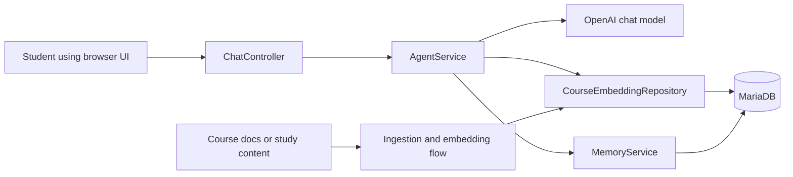

# My Personal Tutor

A Spring Boot and Spring AI study project that brings together chat, retrieval, persistent memory, and a browser UI in one place. This is one of the best folders in the repo for understanding how multiple AI engineering ideas fit together inside a more realistic application.

## What this folder teaches

- How to build a multi-session chat application with Spring AI
- How to combine a chat model with retrieval-augmented generation
- How persistent memory and stored conversation history change user experience
- How a Java backend, database, and browser UI work together in an AI product

## Why this matters

This folder moves beyond isolated demos. It shows what happens when you need state, retrieval, storage, and a user-facing interface in the same application. For professionals, it is a good bridge between proof-of-concept AI features and real product architecture.

## Architecture overview



## Prerequisites

- Java 21
- MariaDB running locally
- Maven or the included Maven wrapper
- An OpenAI API key

## Setup

1. Create a MariaDB database named `tutor_db`
2. Open `src/main/resources/application.yml` and update the datasource username, password, and OpenAI key placeholders
3. Make sure MariaDB is reachable from the JDBC URL configured in that file
4. Let Spring initialize the schema on startup

## How to run

From `C:\projects\TeluskoProjects\AI-Engineering-Live\My_Personal_Tutor`:

```powershell
.\mvnw.cmd spring-boot:run
```

Open the UI at `http://localhost:8080/chat.html`.

## Expected result

You should be able to open the chat UI, create or switch sessions, and ask study-related questions. The app should preserve conversation history and use stored content to ground some responses.

## What to study here

- `src/main/java` for the main service and controller flow
- `AgentService` to understand orchestration between simple chat, retrieval, and tools
- `MemoryService` to understand persistence and session handling
- `schema.sql` and `application.yml` to see how the DB and initialization are wired

## Troubleshooting

- If startup fails, verify the MariaDB port, database name, username, and password
- If AI calls fail, check the OpenAI key value in `application.yml`
- If the UI loads but responses fail, inspect backend logs for model or DB connection errors
- If schema creation fails, check MariaDB version compatibility and SQL initialization settings

## Production considerations

- Move secrets out of config files and into environment variables or a secrets manager
- Add authentication instead of relying on a simple user ID entry
- Add stronger validation, observability, and error handling around tool or retrieval failures
- Consider streaming responses, rate limits, and token or cost monitoring

## What to study next

- Study `21_Project` to compare a product-oriented AI backend
- Study `LANGGRAPH-DEMO` if you want a more workflow-first orchestration style
