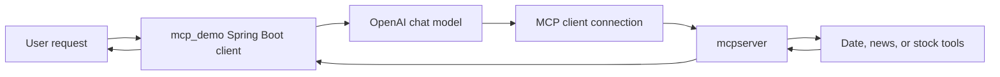

# MCP Demo

This project is the Spring AI MCP client in the repository. It is useful when you want to understand how an AI application consumes tools exposed by an MCP server instead of embedding every tool directly into the same codebase.

## What this folder teaches

- How a Spring AI application connects to an MCP server over SSE
- How an AI client can call external tools through MCP
- Why separating client and server responsibilities matters

## MCP interaction overview



## Prerequisites

- Java 21
- Maven or the included Maven wrapper
- OpenAI API key
- `mcpserver` running locally on port `8282`

## Setup

- Confirm `src/main/resources/application.properties` points to the correct MCP server URL
- Add your OpenAI key using the `OPENAI_API_KEY` placeholder mechanism in that file
- Start `mcpserver` before starting this application

## How to run

Start the server first:

```powershell
cd C:\projects\TeluskoProjects\AI-Engineering-Live\mcpserver
.\mvnw.cmd spring-boot:run
```

Then start the client:

```powershell
cd C:\projects\TeluskoProjects\AI-Engineering-Live\mcp_demo
.\mvnw.cmd spring-boot:run
```

## Expected result

You should be able to send a request to the client endpoint and receive an AI-generated answer that can use tools exposed by the MCP server.

Example endpoint:
- `GET /api/getAIResponse?message=What is the current date and latest stock price of AAPL?`

## What to study here

- `SimpleAiController` for the client-facing endpoint
- `application.properties` for the SSE MCP client configuration
- The interaction between this project and `mcpserver`

## Troubleshooting

- If requests fail, verify that `mcpserver` is already running on port `8282`
- If the model responds without tool support, inspect MCP connection logs
- If startup fails, confirm the OpenAI key and Spring AI dependency resolution

## Production considerations

- Add retries and timeout handling for MCP server calls
- Avoid tightly coupling the client to a single local server URL
- Add auth and access control before exposing sensitive tools through MCP

## What to study next

Read `mcpserver/README.md` next, then compare this pair with `15_MCP_26-12-2025` and `16_MCP_Langchain_29-12-2025`.
