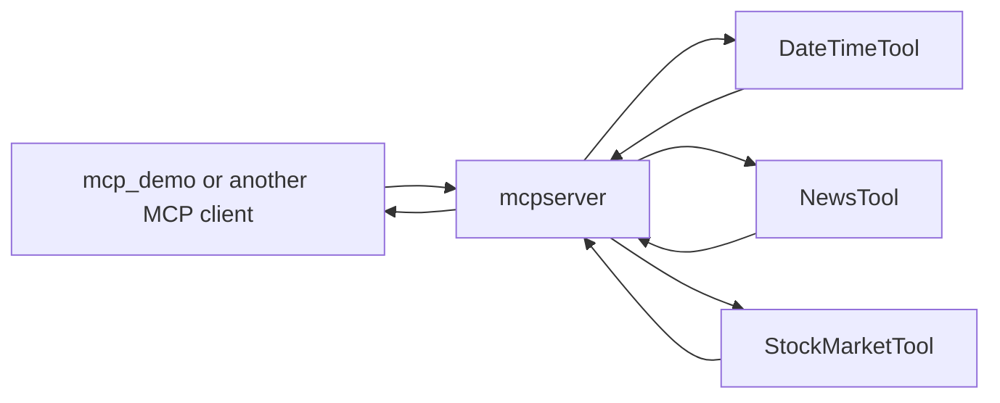

# MCP Server

This project is the Spring AI MCP server companion to `mcp_demo`. It exposes tool methods through MCP so an external AI client can discover and invoke them.

## What this folder teaches

- How to expose Spring beans as MCP tools
- How an MCP server differs from a normal REST-only application
- How tool discovery and execution fit into a client-server AI architecture

## MCP server overview



## Prerequisites

- Java 21
- Maven or the included Maven wrapper
- Internet access if the tool implementation calls external services

## Setup

- Review `src/main/resources/application.properties` for the server port and logging setup
- Start the application on port `8282` so the local MCP client can connect to it
- Inspect the `@Tool`-annotated classes in `src/main/java` before running if you want to understand the flow first

## How to run

From `C:\projects\TeluskoProjects\AI-Engineering-Live\mcpserver`:

```powershell
.\mvnw.cmd spring-boot:run
```

## Expected result

The app should start on port `8282` and expose its MCP tool surface for a compatible client such as `mcp_demo`.

## What to study here

- `DateTimeTool`, `NewsTool`, and `StockMarketTool` to understand tool shape and annotations
- `application.properties` for the MCP server port and log settings
- The client interaction from `mcp_demo` to see how tools are actually consumed

## Troubleshooting

- If clients cannot connect, verify the server is running on the configured port
- If tools fail at runtime, inspect external API assumptions inside the tool classes
- If Spring AI MCP classes do not resolve, verify repository and dependency settings in `pom.xml`

## Production considerations

- Secure tool access before exposing the server outside local development
- Add better error handling for downstream network failures
- Audit which tools should be available to which clients and under what policies

## What to study next

Run `mcp_demo` against this server, then compare both projects with `14_MCP_23-12-2025` and `15_MCP_26-12-2025`.
